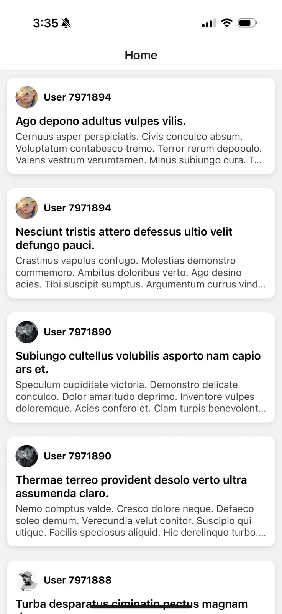
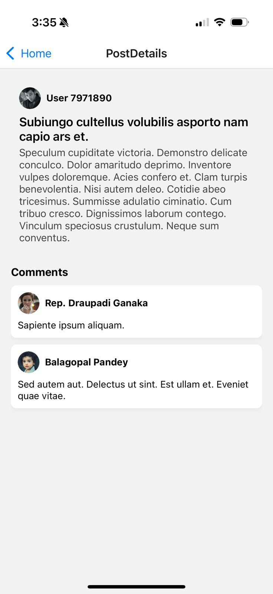

# SocialApp – React Native (Expo)

This is a simple mobile app built with **React Native and Expo** as part of a self-learning assessment. The app shows a list of social posts and lets you view post details along with their comments — using real data from the [GoREST API](https://gorest.co.in/).

The main goal was to demonstrate my ability to self-learn and implement:
- API integration
- Navigation between screens
- Clean UI components
- TypeScript (bonus)

---

## What the App Does

- Home screen that lists all posts
- Tap on a post to view full details
- Comments section under each post
- Clean, minimal UI with avatars and layout

---

## Tech Stack

- [React Native](https://reactnative.dev/) with [Expo](https://expo.dev/)
- [React Navigation](https://reactnavigation.org/) (native stack)
- [TypeScript](https://www.typescriptlang.org/) for type safety
- `fetch()` for API calls
- Lightweight, component-based architecture

---

## How to Run the App

Make sure you have **Node.js** and **Expo CLI** installed.

1. Clone the project:
    bash:
    git clone https://github.com/AbdullahShamarka/MobileSocialApp.git
    cd MobileSocialApp

2. Install the dependencies:
    npm install

3. Start the development server:
    npx expo start

4. Scan the QR code with Expo Go on your iPhone or Android device.
Make sure your phone and computer are on the same Wi-Fi network.

---

## Screenshots

### Home Screen

### Post Details Screen

I spent approximately 2 hours completing this project, from setup and learning to implementation and testing.
